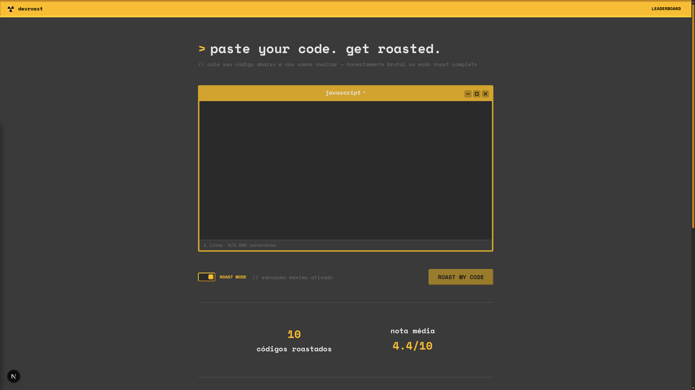
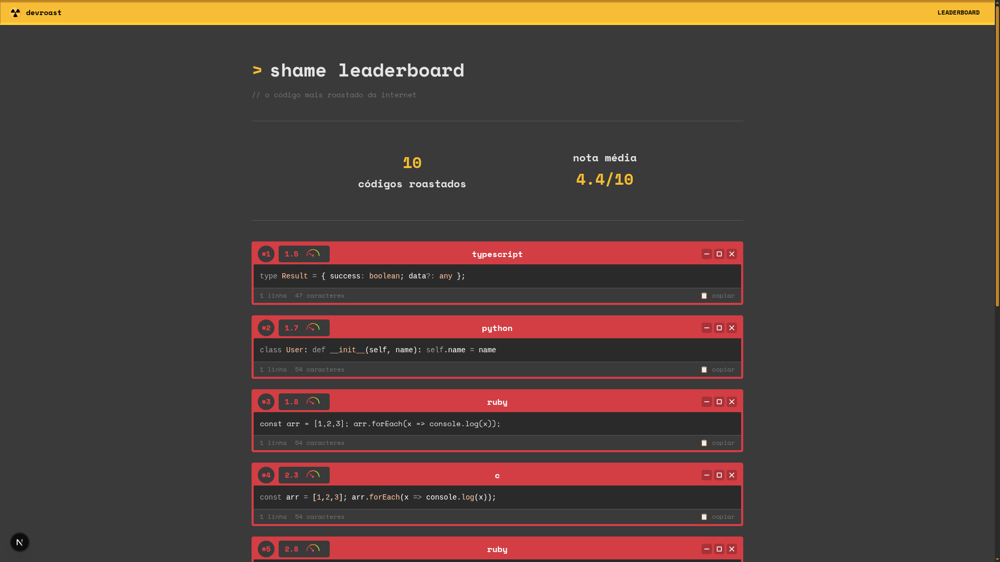
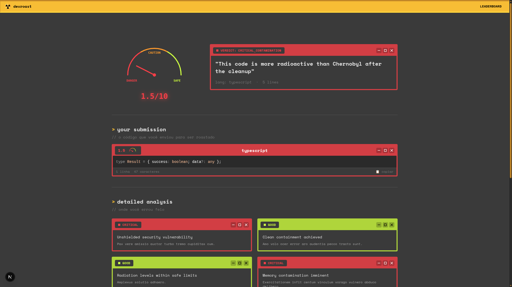

<h1 align="center">☢️ DevRoast</h1>

Coloque qualquer trecho de código na zona de contaminação. Ative o **roast mode** para sarcasmo nuclear máximo. Descubra o nível de radiação do seu código — de `radiation_free` até `critical_contamination`.

> ☢️ Construído durante o NLW da Rocketseat, ao longo das aulas do evento.

## Screenshots

<div align="center">
  <p style="font-size: 1.5em;"><strong>Home</strong></p>
  
  <p align="center"><code>// page.tsx — input para colar o código</code></p>
  <br/>
  <p style="font-size: 1.5em;"><strong>Leaderboard</strong></p>
  
  <p align="center"><code>// leaderboard.tsx — vergonha alheia em tempo real</code></p>
  <br/>
  <p style="font-size: 1.5em;"><strong>Roast</strong></p>
  
  <p align="center"><code>// roast/[id]/page.tsx — o diagnóstico completo do seu código</code></p>
</div>

## Funcionalidades

- Cole seu código e receba uma análise com IA
- Verifique seu score de 1 a 10
- Veja os piores códigos no leaderboard
- Suporte a múltiplas linguagens

## Setup Local

```bash
# Clone o repositório
git clone <repo-url>
cd nlw-operator

# Instale as dependências
npm install

# Configure as variáveis de ambiente
cp .env.example .env.local

# Execute o servidor de desenvolvimento
npm run dev
```

Abra [http://localhost:3000](http://localhost:3000) no seu navegador para ver o resultado.

## Variáveis de Ambiente

Crie um arquivo `.env.local` na raiz do projeto com as seguintes variáveis:

```bash
# URL do banco de dados PostgreSQL
DATABASE_URL=

# Chave da API do Google (para Gemini AI)
GOOGLE_API_KEY=

# URL da aplicação (opcional, para produção)
NEXT_PUBLIC_APP_URL=http://localhost:3000
```

## Tecnologias

- Next.js 16
- React 19
- TypeScript
- tRPC v11
- Drizzle ORM
- PostgreSQL
- Tailwind CSS v4
- Shiki (destaque de sintaxe)
- Gemini AI (análise de código)